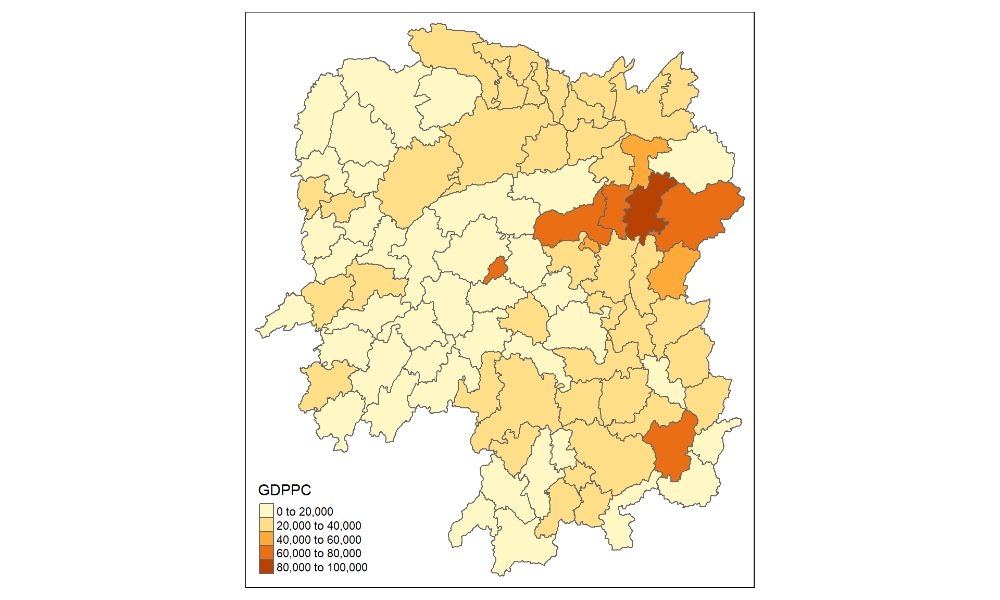

```{r setup, include=FALSE}
knitr::opts_chunk$set(
  echo = TRUE,
  warning = FALSE, 
  message = FALSE,
  fig.width=6, 
  fig.height=4, 
  fig.retina = 3
  )
```

```{r xaringan-themer, include=FALSE, warning=FALSE}
library(xaringanthemer)
style_duo_accent(
  primary_color = "#1381B0",
  secondary_color = "#FF961C",
  inverse_header_color = "#FFFFFF"
)
```

# Content

.vlarge[
- THe Geospatial Analysis Question
- Getting Started
- Global Moran's I
- Global Geary's C
- Getis & Ord G
]

---
# The Geospatial Analysis Question

.pull-left[
Figure below shows the distribution of GDP per capita of Hunan Province, People Republic of China.  
- The administrative boundary is county
- The GDP Per capita data are for 2012. 


.center[
**Is the pattern revealed by the choropleth map distributed at random over spatial?**
]
]

--
.pull-right[
To provide an answer to the question above, two hypothesis can be formulated:

- H0: The geospatial pattern reveals is randomly distributed
- H1: The geospatial pattern reveals is not randomly distributed

Before we go ahead performing the statistical test, we need to select a confidence level.

- 95% confidence level, hence $$\alpha = 0.05$$
]

---
# Getting Started

.pull-left[
Use the code chunk below to install and launch the necessary R packages into R.

```{r}
packages = c('sf', 'spdep', 'tmap', 
             'tidyverse')
for (p in packages){
  if(!require(p, character.only = T)){
    install.packages(p)
  }
  library(p,character.only = T)
}
```
]

.pull-right[
Things to learn from the code chunk on the left:

- **spdep** package provides functions for performing spatial autocorrelation analysis and spatial autocorrelation test.
]

---
# Importing Data

.pull-left[
The code chunk below uses [*st_read()*](https://r-spatial.github.io/sf/reference/st_read.html) of **sf** package to import Hunan shapefile into R.  The imported shapefile will be **simple features** Object of **sf**.

```{r message=FALSE}
hunan <- st_read(dsn = "data/geospatial", 
                 layer = "Hunan")
```
]

--

.pull-right[
Next, we will import *Hunan_2012.csv* into R by using *read_csv()* of **readr** package.  The output is R dataframe class.

```{r}
hunan2012 <- read_csv("data/aspatial/Hunan_2012.csv")
```
]

---
## Performing relational join

.pull-left[
Use the code chunk below to update the attribute table of *hunan*'s SpatialPolygonsDataFrame with the attribute fields of *hunan2012* dataframe.  This is performed by using *left_join()* of **dplyr** package.

```{r}
hunan <- left_join(hunan,hunan2012)
```
]

--
.pull-right[
Things to learn from the code chunk on the left:

- In general, a *by* argument is required to define the unique identifier field from the join tables.  Since both data.frames have a similar fields, we can ignore the *by* argument.  
]

---
# Computing Spatial Weights

.pull-left[
In the code chunk below, [*poly2nd()*](https://r-spatial.github.io/spdep/reference/poly2nb.html) of spdep package is used to compute Queen contiguity weight matrix.

```{r}
wm_q <- poly2nb(hunan, 
                queen=TRUE)
wm_q
```
]

.pull-right[
Things to learn from the code chunk:

- For Rook method, queen = FALSE argument should be used.
]

---
## Row-standardised weight matrix

.pull-left[
Next, [*nb2listw*](https://r-spatial.github.io/spdep/reference/nb2listw.html) of **spdep** package is used to create a raw-standardised weight matrix.

```{r}
rswm_q <- nb2listw(wm_q, 
                   style="W", 
                   zero.policy = TRUE)
rswm_q
```
]

--
.pull-right[
Things to learn from the code chunk:

- Equal weight is used (style="W"). Other more robust options are available, notably style="B".

- The zero.policy=TRUE option allows for lists of non-neighbors. This should be used with caution since the user may not be aware of missing neighbors in their dataset however, a zero.policy of FALSE would return an error.
]

---
## Measure of Global Spatial Autocorrelation
### Maron's I test

.pull-left[
The code chunk below performs Moran's I statistical testing using [*moran.test()*](https://r-spatial.github.io/spdep/reference/moran.test.html) of **spdep**.

```{r}
moran.test(hunan$GDPPC, 
           listw=rswm_q, 
           zero.policy = TRUE, 
           na.action=na.omit)
```
]

--
.pull-right[
Interpretation:

- Since the p-value of 0.000001095 (i.e. 1.095e-06) is smaller than the alpha values of 0.05. We reject the null hypothesis that the spatial patterns are randomly distribution at 95% confidence level.
- The Moran's I of 0.300749970 is positive, hence we can safely infer that the pattern resembles clustering distribution.
]

---
### Computing Monte Carlo Moran's I

.pull-left[
The code chunk below performs permutation test for Moran's I statistic by using [*moran.mc()*](https://r-spatial.github.io/spdep/reference/moran.mc.html) of **spdep**.

```{r}
set.seed(1234)
moran_mc <- moran.mc(hunan$GDPPC, 
                listw=rswm_q, 
                nsim=999, 
                zero.policy = TRUE, 
                na.action=na.omit)
moran_mc
```
]

.pull-right[
Thing to learn from the code chunk:

- set.seed() is used the ensure that the analysis is reproducible.
- nsim = 999 means that 1000 simulation will be performs. 

Interpretation:

- Since the p-value of 0.001 is smaller than the alpha values of 0.05. We reject the null hypothesis that the spatial patterns are randomly distribution at 95% confidence level.
- The Moran's I of 0.30075 is positive, hence we can safely infer that the pattern resembles clustering distribution.
]

---
### Visualising Monte Carlo Moran's I

.pull-left[

The code chunk is used to print out the basic statistics of the modelling results.

```{r eval=FALSE}
mean(moran_mc$res[1:1000])
var(moran_mc$res[1:1000])
summary(moran_mc$res[1:1000])
```

```{r echo=FALSE, eval=TRUE}
mean(moran_mc$res[1:1000])
var(moran_mc$res[1:1000])
summary(moran_mc$res[1:1000])
```
]

.pull-right[

The code chunk below plots the simulated Moran's I as a histogram.

```{r eval=FALSE}
hist(moran_mc$res, 
     freq=TRUE, 
     breaks=20, 
     xlab="Simulated Moran's I")
abline(v=0, col="red") 
```

.center[
```{r echo=FALSE}
hist(moran_mc$res, 
     freq=TRUE, 
     breaks=20, 
     xlab="Simulated Moran's I")
abline(v=0, col="red") 
```
]
]

---
## Geary's
### Computing Geary's C

.pull-left[
The code chunk below performs Geary's C test for spatial autocorrelation by using  [*geary.test()*](https://r-spatial.github.io/spdep/reference/geary.test.html) of **spdep**.

```{r}
geary.test(hunan$GDPPC, 
           listw=rswm_q)
```
]

--
.pull-right[
Interpretation:

- Since the p-value of 0.0001526 is smaller than the alpha values of 0.05. We reject the null hypothesis that the spatial patterns are randomly distribution at 95% confidence level.
- The Geary's C of 0.6907223 is approaching 0, hence we can safely infer that the pattern resembles clustering distribution.
]

---
### A Monte Carlo similation approach of Geary's C

.pull-left[
The code chunk below performs permutation test for Geary's C statistic by using  [*geary.mc()*](https://r-spatial.github.io/spdep/reference/geary.mc.html) of **spdep**.

```{r}
set.seed(1234)
geary_mc=geary.mc(hunan$GDPPC, 
               listw=rswm_q, 
               nsim=999)
geary_mc
```
]

--
.pull-right[
Interpretation:

- Since the p-value of 0.001 is smaller than the alpha values of 0.05. We reject the null hypothesis that the spatial patterns are randomly distribution at 95% confidence level.
- The Geary's C of 0.69072 is approaching 0, hence we can safely infer that the pattern resembles clustering distribution.
]


---
### Visualising the Monte Carlo Geary's C

.pull-left[
The code chunk below prints the summary statistics of the simulation results.

```{r echo=TRUE, eval=FALSE}
mean(geary_mc$res[1:1000])
var(geary_mc$res[1:1000])
summary(geary_mc$res[1:1000])
```

```{r echo=FALSE, eval=TRUE}
mean(geary_mc$res[1:1000])
var(geary_mc$res[1:1000])
summary(geary_mc$res[1:1000])
```
]

--
.pull-right[
The code chunk below plots the simulated Geary's C as a histogram.

```{r eval=FALSE}
hist(geary_mc$res, 
     freq=TRUE, 
     breaks=20, 
     xlab="Simulated Geary c")
abline(v=1, col="red") 
```

.center[
```{r echo=FALSE, eval=TRUE}
hist(geary_mc$res, 
     freq=TRUE, 
     breaks=20, 
     xlab="Simulated Geary c")
abline(v=1, col="red") 
```
]

]

---
## Spatial Correlogram

.pull-left[
Spatial correlograms are great to examine patterns of spatial autocorrelation in your data or model residuals. 
They show how correlated are pairs of spatial observations when you increase the distance (lag) between them - they are plots of some index of autocorrelation (Moran's I or Geary's c) against distance.

Although correlograms are not as fundamental as variograms (a keystone concept of geostatistics), they are very useful as an exploratory and descriptive tool. For this purpose they actually provide richer information than variograms.
]

.pull-right[
Spatial correlogram can be computed by using [sp.correlogram()](https://r-spatial.github.io/spdep/reference/sp.correlogram.html) of spdep package.
]


---
### Compute Moran'I Correlogram 

.pull-left[
The code chunk below is used to compute and plot the Moran's I correlagrom 

```{r}
MI_corr <- sp.correlogram(wm_q, 
                          hunan$GDPPC, 
                          order=6, 
                          method="I", 
                          style="W")
plot(MI_corr)
```
]

--
.pull-right[
The code chunk below is used to print the results of the Moran's I correlagrom

```{r}
print(MI_corr)
```

]

---
### Compute Geary's C Correlogram

.pull-left[
The code chunk below is used to compute and plot Geory's C correlogram 


```{r}
GC_corr <- sp.correlogram(wm_q, 
                          hunan$GDPPC, 
                          order=6, 
                          method="C", 
                          style="W")
plot(GC_corr)
```
]

--
.pull-right[
The code chunk below is used to print the results of Geory's C correlogram 

```{r}
print(GC_corr)
```
]

---
## Getis-Ord Global G

.pull-left[
```{r}
longitude <- map_dbl(hunan$geometry,
                     ~st_centroid(.x)[[1]])
latitude <- map_dbl(hunan$geometry,
                    ~st_centroid(.x)[[2]])
coords <- cbind(longitude, latitude)
knn6 <- knn2nb(knearneigh(coords, k=6))
lw_knn6 <- nb2listw(knn6, 
                    style="B", 
                    zero.policy=TRUE)
ZGi <- globalG.test(hunan$GDPPC, lw_knn6,
                    zero.policy=TRUE)
print(ZGi)
```
]

--
.pull-right[
Interpretation:

- Since the p-value of 0.0000007446 (i.e. 7.446e-07) is smaller than the alpha values of 0.005. We reject the null hypothesis that the spatial patterns are randomly distribution at 95% confidence level.
- The Global G of 0.07855682 (i.e.7.855682e-02) is positive, hence we can safely infer that counties with higher GDP per capita tend to cluster together.

]

