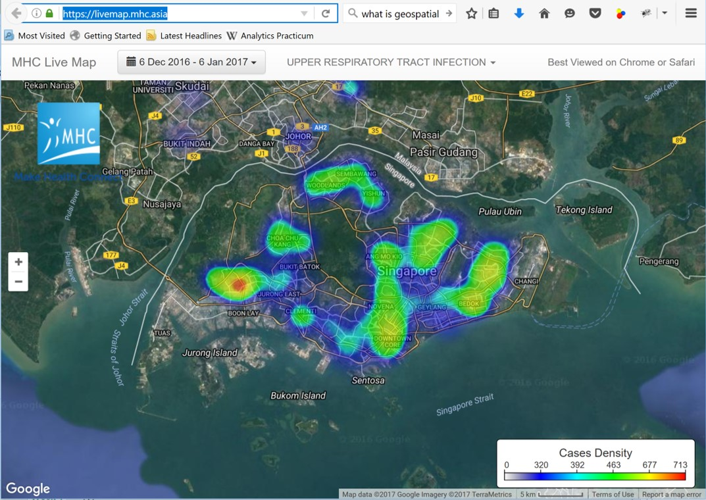

```{r setup, include=FALSE}
knitr::opts_chunk$set(echo = FALSE)
```


# Content

.vlarge[
- Demystifying Geospatial Analytics
- Motivation of Geospatial Analytics
- The Role of Geospatial Analytics
- Geospatial Analytics and Social Consciousness
]

---
## Demystifying Geospatial Analytics
.large[
- A **Geographical Information System (GIS)** is a toolkit for creating, managing, analysing, visualising, and sharing data of any kind according to where it's located.]

.center[
]

.center[
.vlarge[
Geospatial analytics is more than a GIS]]

---
## Demystifying Geospatial Analytics
.large[
- Geospatial analytics is more than data visualisation]
.center[
]

.small[Source: https://livemap.mhc.asia/ and the real geospatial analytics https://wiki.smu.edu.sg/1213t2is415g1/IS415_2012-13_Term2_Assign2_Derek.Lee]

---
## Demystifying Geospatial Analytics
.large[
- Geospatial analytics is more than just mapping]

.pull-left[
]

.pull-right[
]

.small[Source: https://isss608.shinyapps.io/shiny/]


---
## Motivation of Geospatial Analytics

.large[
- About 80% of all data maintained by organisations around the world has a location component.]
.small[(Source: BusinessWeek Research Services, 2006)]

.center[
]

---
## Motivation of Geospatial Analytics
.large[
- Geospatial information in Smart Nation]
.center[
]

.small[
See more at: http://www.straitstimes.com/news/singapore/more-singapore-stories/story/new-3d-map-collate-local-knowledge-part-smart-nation-pro#sthash.aUxbyCei.dpuf]

---
## Motivation of Geospatial Analytics

.large[
- The explosion in the availability of open geospatial data from both the public and private sectors at national and international levels]

.center[
]

---
## Motivation of Geospatial Analytics

.large[
- The national geospatial master plan]

.center[
]

.small[Source:
https://geospatial.sg/initiatives#masterplan]


---
## The role of Geospatial Analytics

.large[
- Uncovering insights not found in statistical graphs and tables.]


.small[Source: https://isss608.shinyapps.io/shiny/]

---
## The role of Geospatial Analytics

.large[
- To reveal the untapped property of spatial contiguity in geographic knowledge discovery in databases.]

.center[
]

.small[Source: https://isss608.shinyapps.io/shiny/]

---
## The role of Geospatial Analytics

.large[
- To uncover the complexity of the real world relationship.]


.small[Source: https://isss608.shinyapps.io/shiny/]

---
## The role of Geospatial Analytics

.large[
- To model spatial interactions and flows.]

.center[
]

.small[Source: https://wiki.smu.edu.sg/17t2is415g1/IS415_TeamJSR_Project]

---
## Geospatial Analytics and Social Consciousness

The true power of geospatial analytics is to provide decision makers and planners with data-driven and process information for better problem solving and more efficient use of resources.

.center[
]

```{r echo=FALSE, eval=FALSE}
library(pagedown)
pagedown::chrome_print("Topic01-Introduction_to_Geospatial_Analytics.html")
```


