```{r setup, include=FALSE}
options(htmltools.dir.version = FALSE)
knitr::opts_chunk$set(
  fig.width=9, fig.height=3.5, fig.retina=3,
  out.width = "100%",
  cache = FALSE,
  echo = TRUE,
  message = FALSE, 
  warning = FALSE,
  fig.show = TRUE,
  hiline = TRUE
)
```

```{r xaringan-themer, include=FALSE, warning=FALSE}
library(xaringanthemer)
style_duo_accent(
  primary_color = "#1381B0",
  secondary_color = "#FF961C",
  inverse_header_color = "#FFFFFF"
)
```

# Content

.large[
- Motivation 
- Network Constrained Kernel Density Estimation (NetKDE)
- Network Constrained 2nd-Order Point Patterns Analysis
    - Network Constrained K-function
    - Network Constrained G-function
]

---
# Motivation

.large[
- Real world geography are heterogeneous and anisotropy.
]

.pull-left[
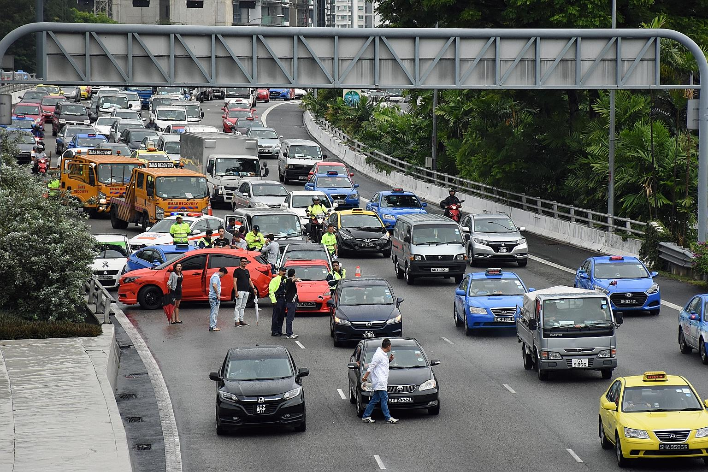
]

.pull-right[
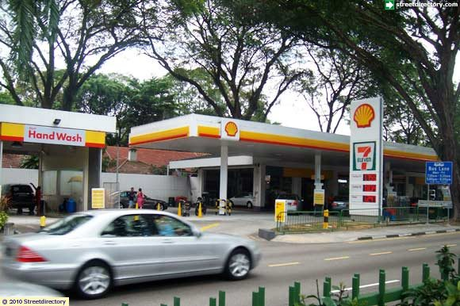
]


---
## What is Network Constrained events

.center[
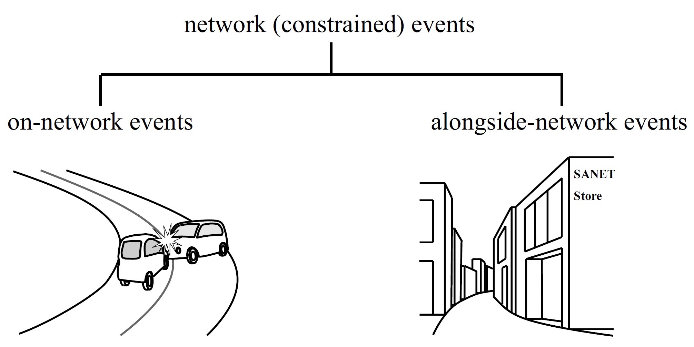
]

---
## Alongside-network relations

.large[
- (a) an access point (the black circle) of a polygon to a network (the horizontal line segment), 
- (b) a boundary line segment of a polygon shared with a network (the bold line segment) 
- (c) an intersection point of two networks (the black circles), 
- (d) a network intersecting an area (the bold line segment).
]

.center[
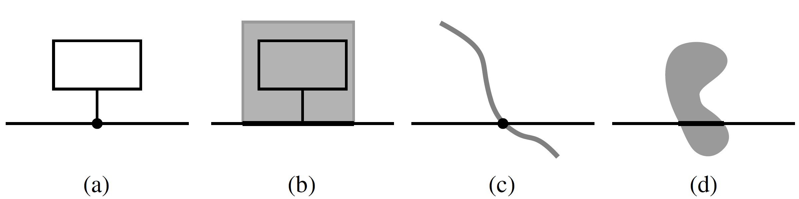
]

---
## Real world network constrained events

.pull-left[
.large[
- A traffic accident events at downtown area.
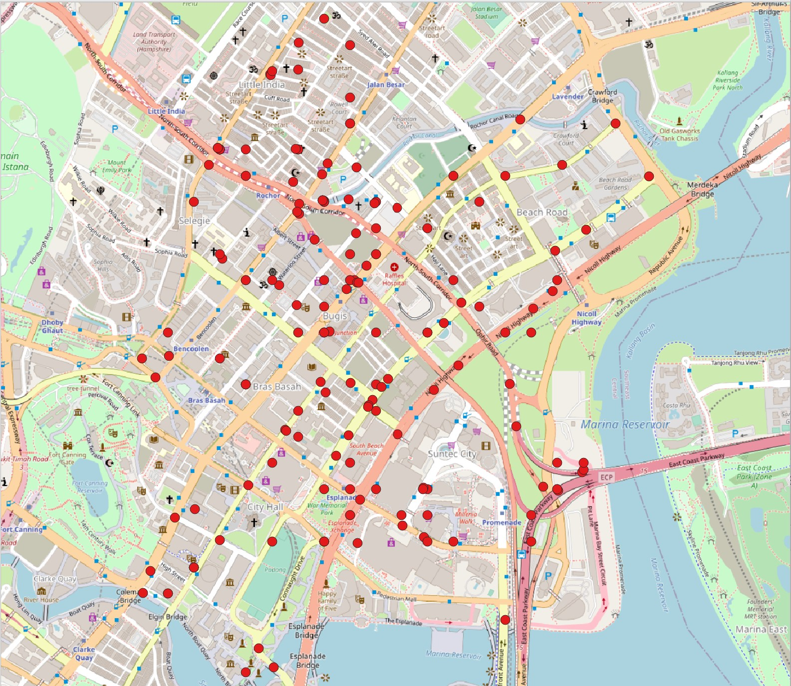
]]

--
.pull-right[
.large[
- Distribution of Airbnb listing at Central region.
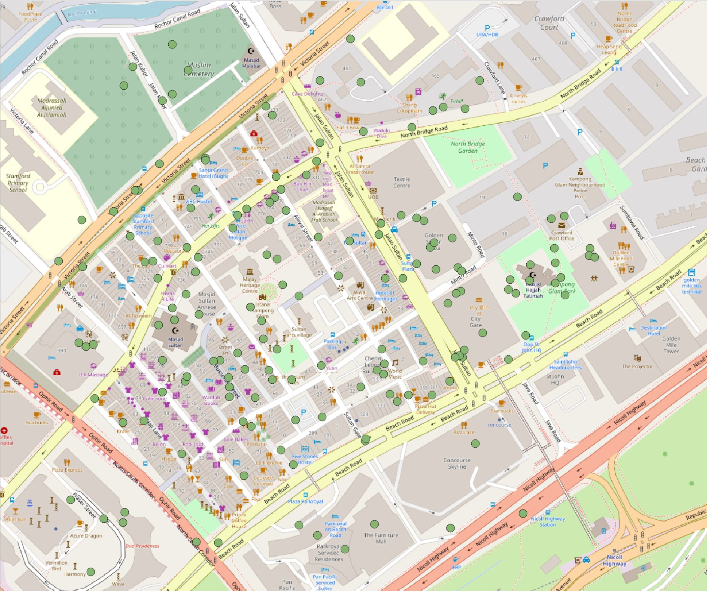
]]

---
## Examples of real world questions

.large[
Typical network constrained events questionsare as follows:
- How can we obtain the catchment areas of parking lots in a downtown area including one-way streets, assuming that drivers access their nearest parking lots?
- Do coffee outlets tend to stand side-by-side alongside streets in a downtown area?
- Do Airbnb listings  tend to locate near to MRT stations?
- Is the roadside retail rental price of a street segment similar to those of the adjacent street segments?
- How can we locate clusters of childcare centres within HDB towns?
- How can we estimate the density of traffic accidents and street crimes incidence, and how can we identify locations where the densities of those occurrence are high, referred to as black spots and hot spots?
- How can we spatially interpolate an unknown PM2.5 density at an arbitrary point on a road using known PM2.5 densities at observation points at CBD?
]

---
## Why is it important to consider the underlying geography?

.large[
- With reference to (a), we will conclude that the spatial event is nonrandomly distributed points on a bounded plane,
- By constraining the points on a network, (b) reveals a randomly distributed patterns.
]

.center[
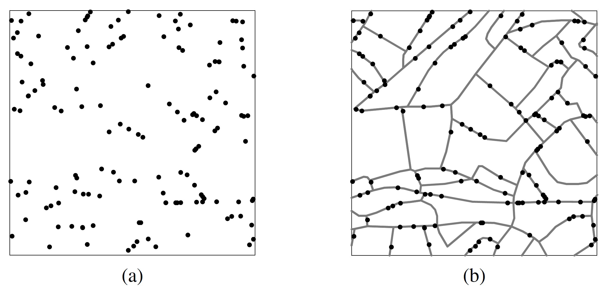
]]

---
## Planar KDE versus Network Constraied KDE (NetKDE)

.pull-left[
.large[
- Kernel function of the Kernel Density estimation
]
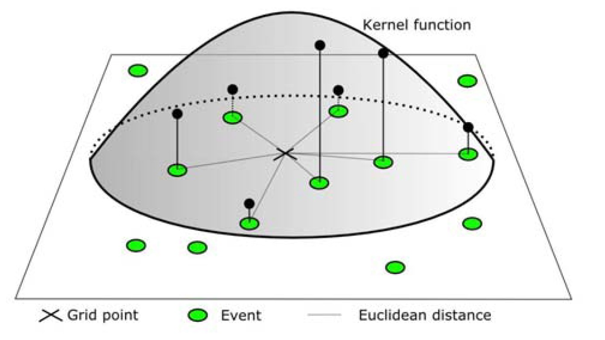
]

--
.pull-right[
.large[
- Shortest Path Tree: The grid point and the activities are projected on the nearest edge.
]
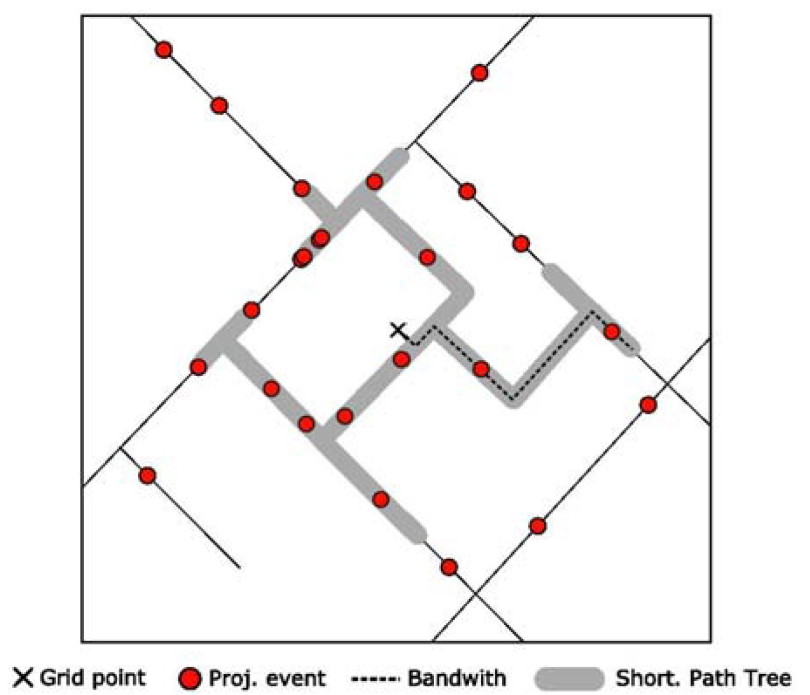
]

---
### NetKDE algorithm: Basic step

.large[
- To perform a NKDE, the events must be snapped on the network. The snapped events are shown here in green.
]

.center[
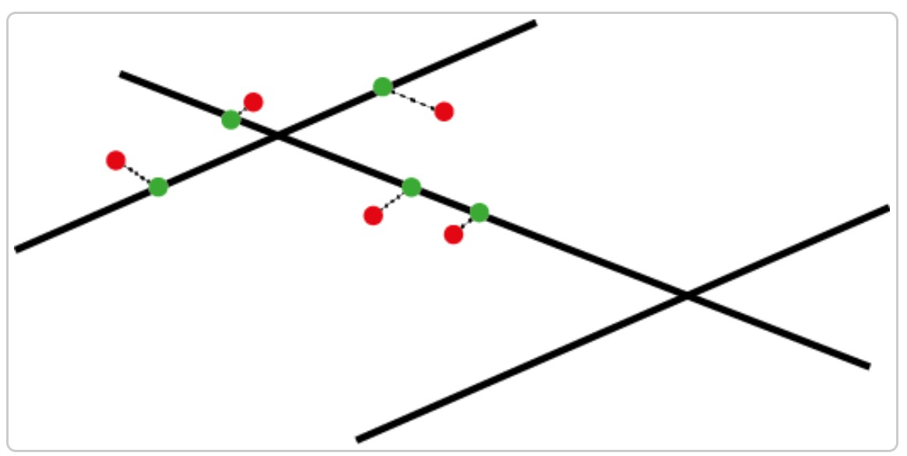
]

.small[
Reference: [Network Kernel Density Estimate](https://cran.r-project.org/web/packages/spNetwork/vignettes/NKDE.html)
]

---
### NetKDE: The kernel function

.pull-left[
.large[
The mass of each event can be seen as a third dimension and is evaluated by a selected kernel function (K) within a specified bandwidth. The kernel function must satisfy the following conditions:

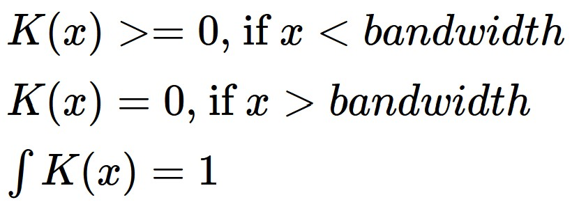

The total mass of an event is 1, and is spread according to the function K within the bandwidth distance.
]
]

.pull-right[
.large[
We can see that the “influence” of each point is limited within the bandwidth and decreases when we move away from the event.

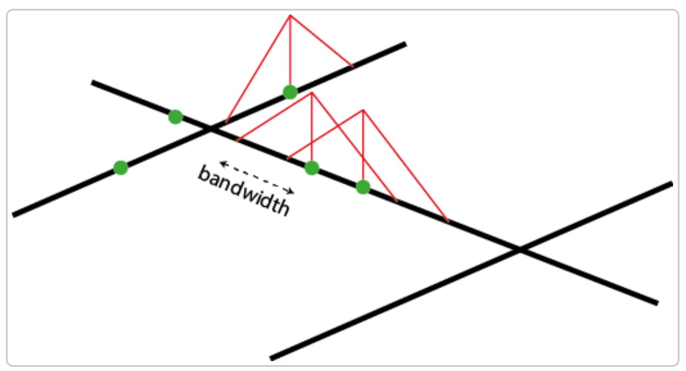
]]

.small[
Reference: [Network Kernel Density Estimate](https://cran.r-project.org/web/packages/spNetwork/vignettes/NKDE.html)
]

---
### More than one point

.pull-left[
.large[In the figure below, 3 sampling points (s1, s2 and s3) are added in blue.

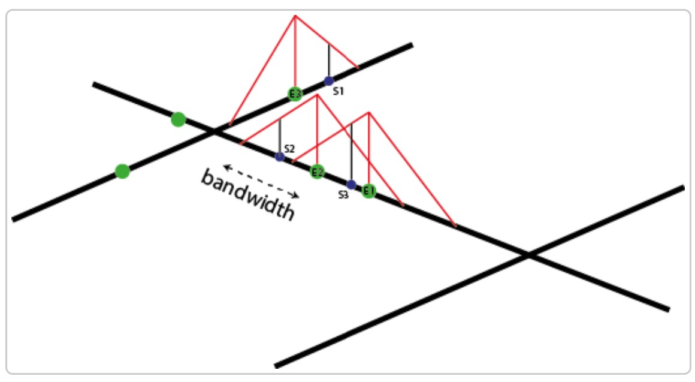
]]

.pull-right[
.large[
The NetKDE formula can be defined as follow:

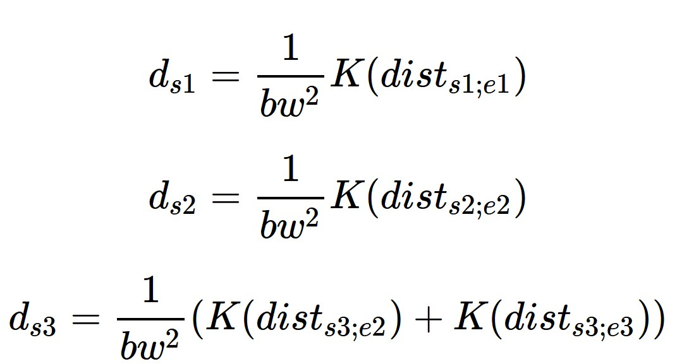
]]

.small[
Reference: [Network Kernel Density Estimate](https://cran.r-project.org/web/packages/spNetwork/vignettes/NKDE.html)
]

---
### The general formula of NetKDE

.pull-left[
.large[
The general formula of NetKDE is defined as:

.center[
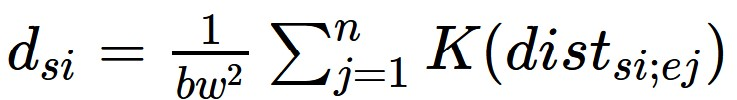
]

with dsi the density estimated at the sample point si, bw the bandwidth and ej an event.
]
]

--
.pull-right[
.large[
The proposed kernel functions in the spNetwork package are:

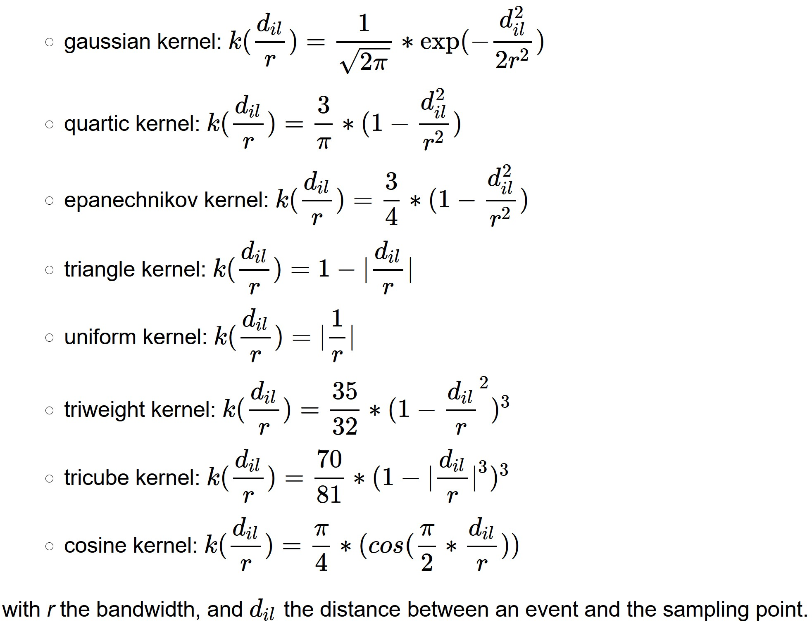

]
]

.small[
Reference: [Network Kernel Density Estimate](https://cran.r-project.org/web/packages/spNetwork/vignettes/NKDE.html)
]

---
## The Simple Method

.large[
The simple method was proposed by Xie and Yan (2008). They defined the NetKDE with the following formula:]

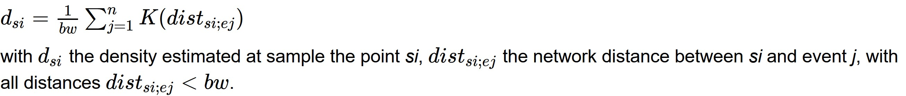

--
.center[
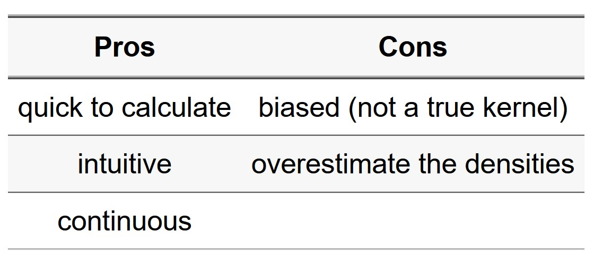
]

.small[
Reference: [Network Kernel Density Estimate](https://cran.r-project.org/web/packages/spNetwork/vignettes/NKDE.html)
]

---
## Discontinuous NetKDE

.pull-left[
.large[
The algorithm is proposed by Sugihara, Satoh, and Okabe (2010).  It is easily presented visually below:
]

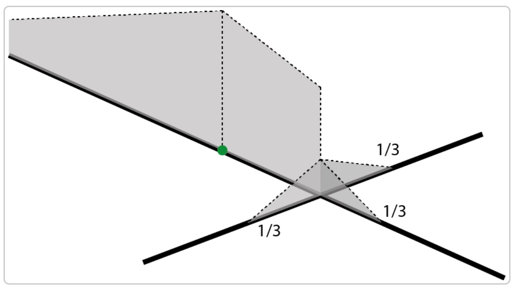
]

--
.pull-right[
.center[
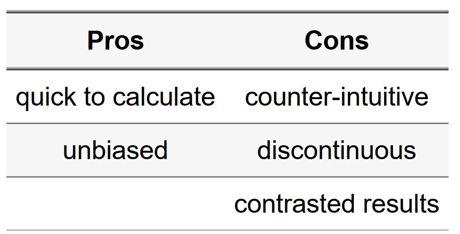
]]

.small[
Reference: [Network Kernel Density Estimate](https://cran.r-project.org/web/packages/spNetwork/vignettes/NKDE.html)
]

---
## Continuous NetKDE

.pull-left[
.large[
The continuous NKDE merges the best of the two worlds:] 

- it adjusts the values of the NetKDE at intersections to ensure that it integrates to 1 on its domain, and 
- applies a backward correction to force the density values to be continuous. 

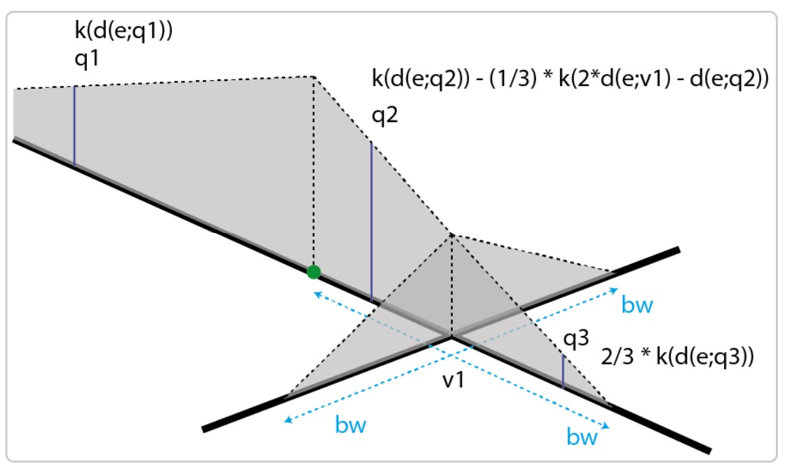
]

--
.pull-right[
.large[
This process is accomplished by a recursive function. It is more time consuming, so it might be necessary to stop it when the recursion is too deep. 

.center[
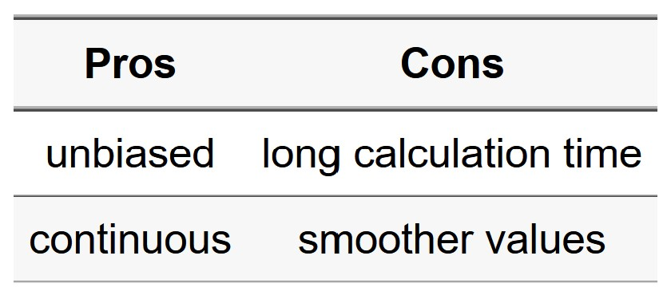
]
]

.small[
Reference: [Network Kernel Density Estimate](https://cran.r-project.org/web/packages/spNetwork/vignettes/NKDE.html)
]
]


---
## Adaptive bandwidth NetKDE

.center[
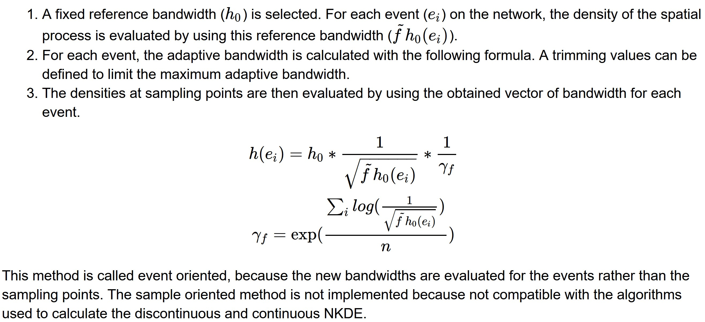

]

.small[
Reference: [Network Kernel Density Estimate](https://cran.r-project.org/web/packages/spNetwork/vignettes/NKDE.html)
]

---
## Planar K-function versus Network K-function 

.center[
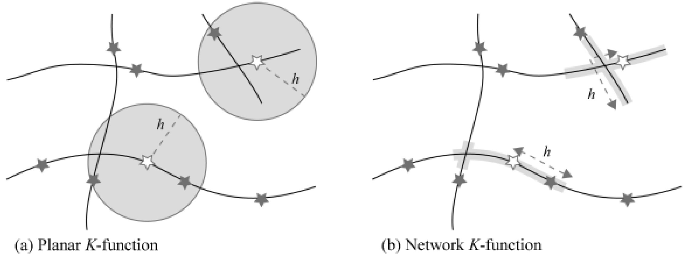
]

---
## Typical Network K-function question

.large[
**Ho: The observed spatial point events (i.e airbnb listings, coffee outlets, traffic accident locations etc) are uniformly
distributed over a street network in a study area.**

- The assumption of the binomial point process implies the hypothesis that objects represented by P (say, airbnb listings) are uniformly and independently distributed over the street network Lp.  

- If this hypothesis is rejected, we may infer that the
spatial point events are spatially interacting and dependent on each other; as a result, they may form nonuniform patterns.
]

---
## Spatial Point Patterns on network

.large[
In general, there are two types of nonuniform spatial point patterns on network, they are:

- clustering whereby the spatial point events tend to be close together (such as in Figure a), and
- repelling (also know as regular) whereby the spatial point event tend to keep away from each other (such as in Figure b). 
]

.center[
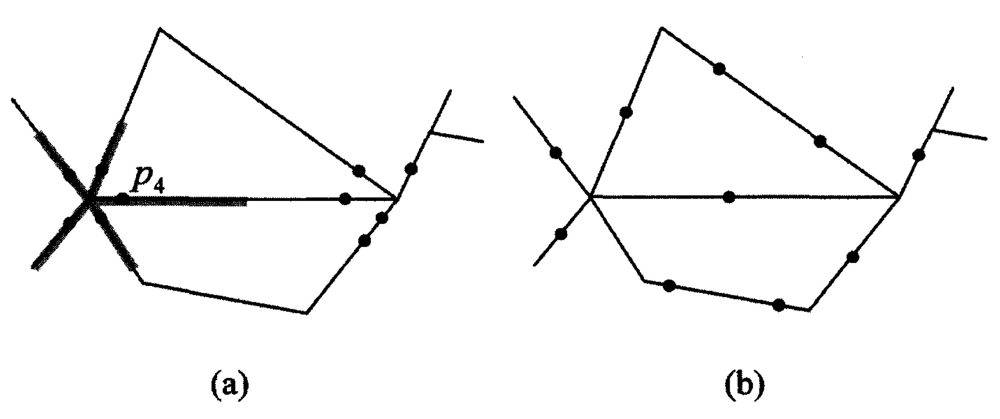
]

.small[
Reference: Atsuyuki Okabe and Ikuho Yarnada (2001) "The K-Function Method on a Network and Its Computational Implementation", **Geographical Analysis**, Vol. 33, No. 3, pp. 271-290
]

---
## The Network K-function 

.large[
Under the assumption of the binomial point process, network k-function K(t) (Atsuyuki Okabe and Ikuho Yarnada, 2001) is defined as:
]

.center[
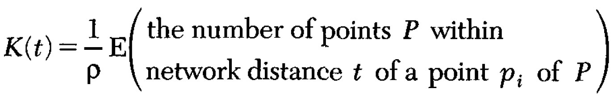


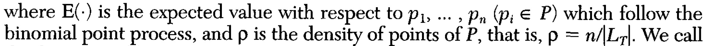
]

.small[
Reference: Atsuyuki Okabe and Ikuho Yarnada (2001) "The K-Function Method on a Network and Its Computational Implementation", **Geographical Analysis**, Vol. 33, No. 3, pp. 271-290
]

---
## Typical Network Cross K-function question

.large[
For instance, the set A may be the set of Airbnb listings and the set B may be the set of MRT stations. We are concerned with whether the locations of MRT stations affect the distribution of Airbnb listing. 

**Ho:  Airbnb listings are distributed according to the binomial point process.** 

- This assumption implies that Airbnb listings are uniformly and independently distributed over LT regardless of the locations of MRT stations. 

- If the above hypothesis is rejected, we may infer that the locations of MRT stations affect the distribution of Airbnb listing. 

It should be noted that no assumption is made with respect to the distribution of points B.
]

---
## The Network Cross K-function 

.center[

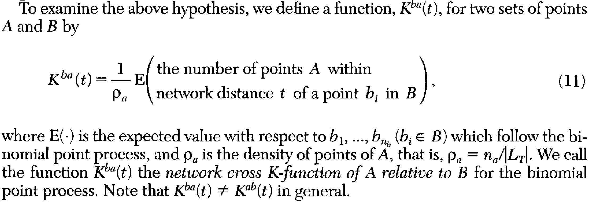
]

.small[
Reference: Atsuyuki Okabe and Ikuho Yarnada (2001) "The K-Function Method on a Network and Its Computational Implementation", **Geographical Analysis**, Vol. 33, No. 3, pp. 271-290
]


---
# References

.large[
Okabe, Atsuyuki and Yarnada, Ikuho (2001) "The K-Function Method on a Network and Its Computational Implementation", *Geographical Analysis*, Vol. 33, No. 3, pp. 271-290


Abramson, Ian S. 1982. “On Bandwidth Variation in Kernel Estimates-a Square Root Law.” *The Annals of Statistics*, 1217–23.

Okabe, Atsuyuki, and Kokichi Sugihara. (2012) **Spatial Analysis Along Networks: Statistical and Computational Methods**. John Wiley & Sons.

Sugihara, Kokichi, Toshiaki Satoh, and Atsuyuki Okabe (2010) “Simple and Unbiased Kernel Function for Network Analysis.” *In 2010 10th International Symposium on Communications and Information Technologies*, 827–32. IEEE.

Xie, Zhixiao, and Jun Yan (2008) “Kernel Density Estimation of Traffic Accidents in a Network Space.” *Computers, Environment and Urban Systems* 32 (5): 396–406.


]


```{r echo=FALSE, eval=FALSE}
library(pagedown)
pagedown::chrome_print("Topic05-NetSPPA.html")
```


