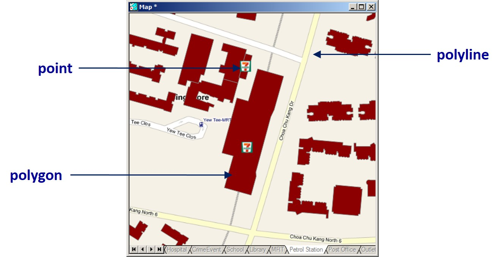
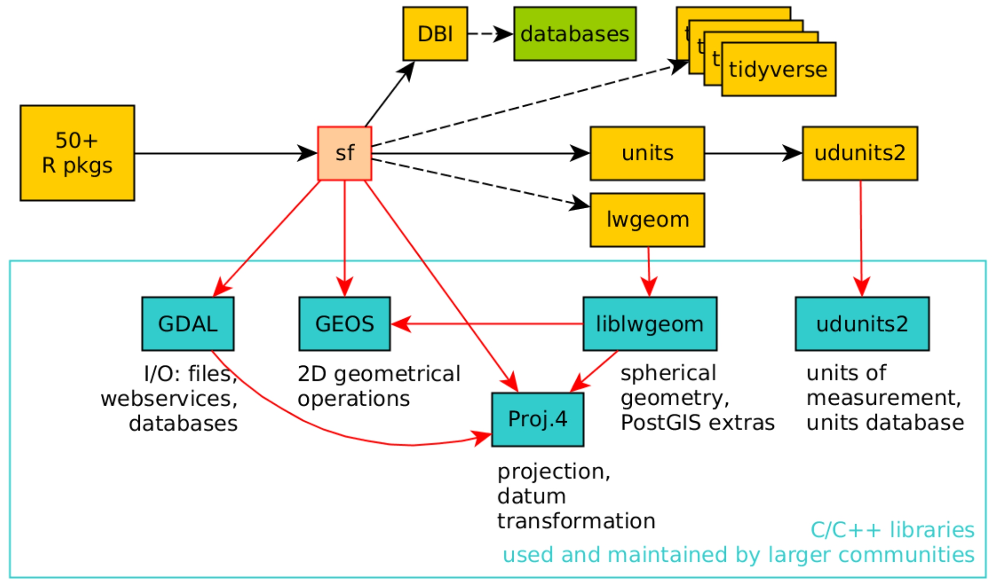

```{r setup, include=FALSE}
knitr::opts_chunk$set(echo = FALSE)
```

```{r xaringan-themer, include=FALSE, warning=FALSE}
library(xaringanthemer)
style_duo_accent(
  primary_color = "#1381B0", 
  secondary_color = "#FF961C",
  inverse_header_color = "#FFFFFF")
```

## Content

.large[
- An overview of Geospatial Data Models
    - Vector and raster data model
    - Coordinate systems and map projection

- Handling Geospatial Data in R: An Overview

- SpatialData approach
    - **sp** package
    - **rgdal** package
    - **rgeo** package

- Simple features approach  
    -  **sf** package
] 

---
## Geospatial Data Models
### Why should we worry about?

.center[
]

---
## Basic Spatial Data Models

.large[
- Vector - implementation of discrete object conceptual model
    - Point, line and polygon representations.
    - Widely used in cartography, and network analysis.

- Raster – implementation of field conceptual model
    - Array of cells used to represent objects.
    - Useful as background maps and for spatial analysis.]
    
---
### Vector Data Models

.pull-left[
.large[
- There are three basic geometric primitives, namely: **points**, **lines (or polylines)** and **polygons**.
- A point is composed of one coordinate pair representing a specific location in a coordinate system.
- A polyline is composed of a sequence of two or more coordinate pairs called vertices.
- A polygon is composed of three or more line segments whose starting and ending coordinate pairs are the same.
]]

.pull-right[
.large[
- Building footprints are represented by polygon features, road reserves represented by polyline features, and convenient stores are represented by point features.]

]

---
### Raster Data Models

.large[
- All raster formats are basically the same 
    - Cells organized in a matrix of rows and columns.
    - Content is more important than format: data or picture?
]

.center[
]


---
## Coordinate Systems and Map Projections
### What is a coordinate system?

- A coordinate system is a reference system used to represent the locations of geographic features, imagery, and observations such as GPS locations within a common geographic framework.

- Each coordinate system is defined by:
    - Its measurement framework which is either geographic (in which spherical coordinates are measured from the earth's center) or planimetric (in which the earth's coordinates are projected onto a two-dimensional planar surface).
    - Unit of measurement (typically feet or meters for projected coordinate systems or decimal degrees for latitude–longitude).
    - The definition of the map projection for projected coordinate systems.
    - Other measurement system properties such as a spheroid of reference, a datum, and projection parameters like one or more standard parallels, a central meridian, and possible shifts in the x- and y-directions.
    
- There are two common types of coordinate systems used in mapping, namely: **geographic coordinate systems** and **projected coordinate system**.

---
### Geographical Coordinate Systems

.pull-left[
.large[
- Define locations on the earth using a three-dimensional spherical surface
    - For example, WGS84
- Unit of measurement will be in either decimal degree or degree-minute-second format.]]

.pull-right[
]

.small[Reference: http://en.wikipedia.org/wiki/Map_projection]

---
### Projected Coordinate Systems

.pull-left[
.large[
- A **projected coordinate system** based on a map projection such as transverse Mercator, Albers equal area, or Robinson, all of which (along with numerous other map projection models) provide various mechanisms to project maps of the earth's spherical surface onto a two-dimensional Cartesian coordinate plane. 
- Projected coordinate systems are sometimes referred to as **map projections**.
    - For example, SVY21]
]

.pull-right[
]

---
### Singapore Projected Coordinate System

.center[
]

.small[Reference: http://www.asprs.org/resources/grids/01-2006-singapore.pdf
]

---
## Standard for Geospatial Data Handling and Analysis

.large[
The OGC OpenGIS Implementation Standard for Geographic Information / ISO 19125 defines:

- **Geometric objects** which can be of type point, line, polygon, multi-point, etc, and are associated to a given Coordinate Reference System;
- **Methods on geometric objects** return properties like dimension, boundary, area, centroid, etc;
- **Methods for testing spatial relations between geometric objects** equals, disjoint, intersects, touches, crosses, within, contains, overlaps and relate, which returns TRUE or FALSE;
- **Methods that support spatial analysis** distance, which returns a distance, and buffer, convex hull, intersection, union, difference, and symmetric difference, which returns new geometric objects.]

Source: www.opengeospatial.org/standards/sfa


---
## Geospatial Data Object Framework 

.large[
- To begin with, all contributed packages for handling spatial data in R had different representations of the data.  This made it difficult to exchange data both within R between packages, and between R and external le formats and applications.

- The first general package to provide classes and methods for spatial data types that was developed for R is called [**sp**](https://cran.r-project.org/web/packages/sp/vignettes/intro_sp.pdf).  It was first released on CRAN in 2005.

- In late October 2016, [**sf**](https://journal.r-project.org/archive/2018/RJ-2018-009/RJ-2018-009.pdf) was first released on CRAN to provide standardised support for vector data in R.] 

---
## R packages that support spatial classes 

.large[
In general, three R packages will be used to handle vector-based geospatial data in spatial classes, they are:  

- [**sp**](https://cran.r-project.org/web/packages/sp/index.html) provides classes and methods for dealing with spatial data in R.

- [**rgdal**](https://cran.r-project.org/web/packages/rgdal/index.html) allows R to understand the structure of a geospatial data file by providing functions to read and convert geospatial data into easy-to-work-with R dataframes.

- [**rgeos**](https://cran.r-project.org/web/packages/rgeos/index.html) implements the methods of the OGC standard.
]

---
## Spatial classes in **sp** package

.large[
- The foundational structure for any spatial object in sp is the Spatial class. It has two “slots” (new-style S4 class objects in R have pre-defined components called **slots**):

    - a bounding box
    - a CRS class object to define the Coordinate Reference System

- This basic structure is then extended, depending on the characteristics of the spatial object (point, line, polygon).]

---
## Spatial*DataFrames

.pull-left[
.large[
- Spatial*DataFrames are constructed as Janus-like objects, 

    - looking to mapping and GIS people as "their" kind of object, as a collection of geometric features, with data associated with each feature. 
    - But to data analysts, the object "is" a data frame, because it behaves like one.
]]

.pull-right[
]

---
### Spatial Points

.pull-left[
- The most basic spatial data object is a point, which may have 2 or 3 dimensions.
- A single coordinate, or a set of such coordinates, may be used to define a **SpatialPoints** object; coordinates should be of mode double and will be promoted if not.
- The points in a **SpatialPoints** object may be associated with a row of attributes to create a **SpatialPointsDataFrame** object.
- The coordinates and attributes may, but do not have to be keyed to each other using ID values.]

.pull-right[
]

---
### Spatial Lines and Polygons objects
.pull-left[
- A **Line** object is just a spaghetti collection of 2D coordinates; a Polygon object is a Line object with same first and last coordinates.
- A **Lines** object is a list of line objects, such as all the contours at a single elevation and a **Polygons** object is a list of polygon objects, such as islands belonging to the same planning zone. A comment is added to each **Polygons** object to indicate which interior ring belongs to which exterior ring (SFS).
- **SpatialLines** and **SpatialPolygons** objects are made using lists of Lines or Polygons objects respectively.
- **SpatialLinesDataFrame** and **SpatialPolygonsDataFrame** objects are defined using **SpatialLines** and **SpatialPolygons** objects and standard data frames, and the ID fields are here required to match the data frame row names.]

.pull-right[
]


---
###  Spatial Grids and Pixels

.pull-left[
- **The GridTopology** class is the key constituent of raster representations. 
- There are two representations for data on regular rectangular grids (oriented N-S, E-W): **SpatialPixels** and **SpatialGrid**.
- **SpatialPixels** are like SpatialPoints objects, but the coordinates have to be regularly spaced; the coordinates are stored, as are grid indices.
- **SpatialPixelsDataFrame** objects only store attribute data where it is present, but need to store the coordinates and grid indices of those grid cells.
- **SpatialGridDataFrame** objects do not need to store coordinates, because they fill the entire defined grid, but they need to store NA values where attribute values are missing.
]

.pull-right[
]

---
## Coordinates Reference Systems in R

.large[
- The EPSG list among other sources is used in the workhorse PROJ.4 library, which as implemented by Frank Warmerdam handles transformation of spatial positions between different CRS.
- This library is interfaced with R in the **rgdal** package, and the CRS class is defined partly in sp, partly in rgdal.
- A **CRS** object is defined as a character NA string or a valid PROJ.4 CRS definition.
- In R, the notation used to describe the CRS is **proj4string** from the **PROJ.4** library.  It looks like this:

> +init=epsg:4121 +proj=longlat+ellps=GRS80 +datum=GGRS87 +no_defs+towgs84=-199.87,74.79,246.62
]

---
## An introduction to simple features

.large[
- **feature**: abstraction of real world phenomena (type or instance); has a geometry and other attributes (properties)
- **simple feature**: feature with all geometric attributes described piecewise by straight line or planar interpolation between sets of points (no curves)
- It is a hierarchical data model that simplifies geographic data by condensing a complex range of geographic forms into a single geometry class.]

---
### Simple features specification

- [*Simple features specification*](https://en.wikipedia.org/wiki/Simple_Features) is an open standard developed and endorsed by the Open Geospatial Consortium (OGC) to represent a wide range of geographic information. 
.center[ 
]

---
### Commonly used simple features

- Only 7 out of 17 possible types of simple feature are currently used in the vast majority of GIS operations.

.center[
]

---
### Simple Features: How they look like?
.center[
]

---
### Simple Features: How they look like?
.center[
]

---
## Introducing [**sf**](https://cran.r-project.org/web/packages/sf/index.html) Package

.large[
- represents natively in R all 17 simple feature types for all dimensions (XY, XYZ, XYM, XYZM),
- uses S3 classes: simple features are data.frame objects (or tibbles) that have a geometry list-column,
- interfaces to GEOS to support the DE9-IM,
- interfaces to GDAL with driver dependent dataset or layer creation options, Date and DateTime (POSIXct) columns, and coordinate reference system, 
- transformations through PROJ.4,
- provides fast I/O with GDAL and GEOS using well-known-binary written in C++/Rcpp, and
- directly reads from and writes to spatial databases such as PostGIS using DBI.]

---
### sfg : geometry for one feature

.center[
]

---
### sf: objects with simple features

.pull-left[
.large[
- In green a **simple feature**: a single record, or data.frame row, consisting of attributes and geometry.
- In blue a single **simple feature geometry** (an object of class **sfg**).
- In red a **simple feature list-column** (an object of class **sfc**, which is a column in the data.frame).]
]

.pull-right[
]


---
### Precision

.large[
One of the attributes of a geometry list-column (sfc) is the precision: a double number that, when non-zero, causes some rounding during conversion to WKB, which might help certain geometrical operations succeed that would otherwise fail due to floating point representation. 

The model is that of GEOS, which copies from the Java Topology Suite (JTS), and works like this:

- if precision is zero (default, unspecified), nothing is modified.
- negative values convert to float (4-byte real) precision.
- positive values convert to round(x*precision)/precision.]

---
## sf functions

.vlarge[
- Geospatial data handling 

- Geometric confirmation

- Geometric operations

- Geometry creation

- Geometry operations

- Geometric measurement

]


---
### Geospatial data handling functions

.large[
- st_read & read_sf: read simple features from file or database, or retrieve layer names and their geometry type(s)
- st_write & write_sf: write simple features object to file or database
- st_as_sf: convert a sf object from a non-geospatial tabular data frame
- st_as_text: convert to WKT
- st_as_binary: convert to WKB
- st_as_sfc: convert geometries to sfc (e.g., from WKT, WKB) as(x, "Spatial"): convert to Spatial*
- st_transform(x, crs, ...) Convert coordinates of x to a different coordinate reference system
]

---
### Geometric confirmation

.large[
- st_intersects: touch or overlap
- st_disjoint: !intersects
- st_touches: touch
- st_crosses: cross (don't touch)
- st_within: within
- st_contains: contains
- st_overlaps: overlaps
- st_covers: cover
- st_covered_by: covered by
- st_equals: equals
- st_equals_exact: equals, with some fuzz returns a sparse (default) or dense logical matrix]

Note: These functions return a logical matrix indicating whether each geometry pair meeting the logical operation. 

---
## sf Methods
### Geometry generating logical operators

.large[
- st_union: union of several geometries
- st_intersection: intersection of pairs of geometries
- st_difference: difference between pairs of geometries
- st_sym_difference: symmetric difference (xor)]

---
## sf Methods
### Higher-level operations: summarise, interpolate, aggregate, st_join

.large[
- aggregate and summarise use st_union (by default) to group feature geometries
- st_interpolate_aw: area-weighted interpolation, uses st_intersection to interpolate or redistribute attribute values, based on area of overlap:
- st_join uses one of the logical binary geometry predicates (default: st_intersects) to join records in table pairs]

---

## sf Methods
### Manipulating geometries

.large[
- st_line_merge: merges lines
- st_segmentize: adds points to straight lines
- st_voronoi: creates voronoi tesselation
- st_centroid: gives centroid of geometry
- st_convex_hull: creates convex hull of set of points
- st_triangulate: triangulates set of points (not constrained)
- st_polygonize: creates polygon from lines that form a closed ring
- st_simplify: simplifies lines by removing vertices
- st_split: split a polygon given line geometry
- st_buffer: compute a buffer around this geometry/each geometry
- st_make_valid: tries to make an invalid geometry valid (requires lwgeom)
- st_boundary: return the boundary of a geometry]

---
## sf Methods
### Convenience functions
.large[
- st_zm: sets or removes z and/or m geometry
- st_coordinates: retrieve coordinates in a matrix or data.frame
- st_geometry: set, or retrieve sfc from an sf object
- st_is: check whether geometry is of a particular type]

---
## Introducing sf package
### sf and other geospatial packages
.center[
]

---
## Introducing sf package
### sf & tidyverse
.large[
- sf spatial objects are data.frames (or tibbles)
- you can always un-sf, and work with tbl_df or data.frame having an sfc list-column
- sf methods for filter, arrange, distinct, group_by, ungroup, mutate, select have sticky geometry
- *st_join()* joins tables based on a spatial predicate
- summarise unions geometry by group (or altogether)]

---
## References
### All About **sf** package

* [Reference manual](https://r-spatial.github.io/sf/reference/index.html)

**Vignettes:**

1. [Simple Features for R](https://cran.r-project.org/web/packages/sf/vignettes/sf1.html) 
2. [Reading, Writing and Converting Simple Features](https://cran.r-project.org/web/packages/sf/vignettes/sf2.html)
3. [Manipulating Simple Feature Geometries](https://cran.r-project.org/web/packages/sf/vignettes/sf3.html)
4. [Manipulating Simple Features](https://cran.r-project.org/web/packages/sf/vignettes/sf4.html)
5. [Plotting Simple Features](https://cran.r-project.org/web/packages/sf/vignettes/sf5.html)
6.  [Miscellaneous](https://cran.r-project.org/web/packages/sf/vignettes/sf6.html)

**Others**
1. [R spatial follows GDAL and PROJ development](https://www.r-spatial.org/r/2020/03/17/wkt.html)


```{r echo=FALSE, eval=FALSE}
library(pagedown)
pagedown::chrome_print("Lesson02-Wrangling_Geospatial_Data_in_R.html")
```

